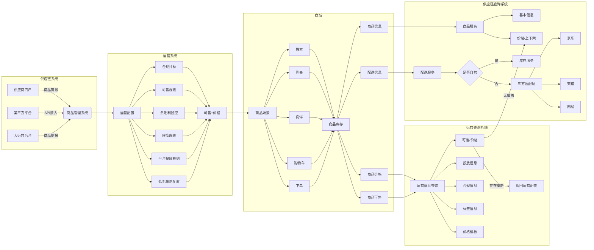

import Twemoji from './Twemoji.tsx'
import UnsplashPhotoInfo from './UnsplashPhotoInfo.tsx'

# 商品体系介绍

### 系统定位与价值

*   **核心定位**

*   **供应链系统**：负责商品全生命周期管理

*   **运营中台**：提供可售策略、定价策略的配置与执行能力

*   **协同模式**：供应链为底座，运营中台为策略引擎，共同支撑多业务线（如百福得、官网、产品册）

*   **核心价值**

*   **对供应    链**：统一多来源的商品管理，保障库存准确性

*   **对运营**：灵活策略配置，实现“千企千面”    

*   **对业务**：支撑多销售平台的统一商品服务

### 系统架构全景

*   系统链路（供应链 -> 运营 -> 商城 -> 运营 -> 供应链）

*   商品上架流程

### 供应链系统详解

*   核心职责

*   **商品引入**：自营/代发商品提报、第三方API商品自动接入

*   **商品管理**：面向东福的管理人员对商品信息进行调整、上下架、改价，维护商品前后台分类、品牌等基础信息

*   **履约保障**：库存管理、库存查询与扣减、物流时效计算、供应链采购、调拨等

*   系统模块

*   供应链实体商品模型关系图

*   自营（入仓/代发）商品提报

*   三方对接商品自动接入

*   京东对接详细说明

*   自营库存初始化

*   自营库存新增场景

*   虚拟库存

*   自营商品与API对接商品核心差异点

| 维度       | 自营入仓             | 自营代发              | 三方对接       |
| ---------- | -------------------- | --------------------- | -------------- |
| 商品模型   | 东福自定义           | 东福自定义            | 三方适配东福   |
| 成本结算   | 按采购结算（集采价） | 一件代发（裸价+运费） | 按协议价结算   |
| 数据时效   | 实时准确             | 实时准确              | 按通知定时处理 |
| 库存所有权 | 我方100%管控         | 供应商自主维护        | 第三方系统提供 |
| 库存可信度 | 高                   | 中                    | 中             |

*   电券商品模型关系图

*   电子券券码模型

### 运营中台详解

*   运营系统功能模块

*   运营系统数据模型关系图

*   运营定价能力

*   通用定价

*   修改供应链引入后的售价，面向所有客户

*   平台（工会）定价策略

*   根据商品调整工会商品价格

*   根据兑换平台（甄选、百福得）自动设置工会低价策略（工会命中后自动使用低价）

*   根据频道人工调整工会频道低价策略（设置后工会某频道使用低价）

*   根据频道、前后台分类设置商品限高策略（商品命中后自动改价）

*   价格展示场景：

相关截图未完成

*   商品可售策略

*   通用可售规则：根据商品毛利、售价设置商品自动可售规则（命中规则后商品自动不可售）

*   工会可售规则：规则同上（到工会维度，建设中）

*   企业折扣负毛利监控：企业频道使用折扣后负毛利自动设置不可售

*   商品投放策略

*   投放规则：根据频道、毛利率设置自动投放规则（到百福得、甄选、官网维度，建设中）

*   标签系统

*   自定义标签

*   按兑换平台投放

*   自定义关联商品

*   按页面投放（搜索、分页类、凑单页）

*   标签展示场景：

| 商品列表展示                                                 | 商详展示                                                     | 搜索展示                                                     | 搜索过滤                                                     |
| ------------------------------------------------------------ | ------------------------------------------------------------ | ------------------------------------------------------------ | ------------------------------------------------------------ |
|  |  |  |  |

*   *
